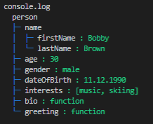
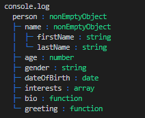

# treeifier-utils

This javascript/typescript library is extending the functionality of the [treeifier core library][treeifier]. It provides:

- multiple treeifier processor functions:
  - **defaultColoredValuesProcessor**: colored (using chalk) tree representation displaying *objects values* (output: string)
  - **defaultColoredTypesProcessor**: colored (using chalk) tree representation displaying *objects types* (output: string)
  - **defaultHTMLProcessor**: structured representation using *html tags*, classes for styling and links/anchors for circular references (output: string)
  - **debug** and **debugResultNode**: tree representation of the node structure of the input object as generated by treeifier during parsing. Those functions may help to debug a processor function of your own (output: string)
- The **colors** of the output provided by the default processors can be **modified**
- (NOT RELEASED YET) A CLI to generate a tree representation of:
  - a local directory structure (folders and files)
  - the content of JSON files

Note: The provided processor functions may not fulfill all of your requirements, though they can be used as a reference to help develop your own processor function. To learn how to write your own processor function, see the documentation on [Writing a "processor" function][write-processor] and have a look at the source code of this library.

## screenshots (output examples)

Usage of the `defaultColoredValuesProcessor` &amp; `defaultColoredTypesProcessor`:

|*values* colored ASCII tree (string)|*types* colored ASCII tree (string)
|:---:|:---:|
|  |  |
|`myTreeifier.process( aPerson, 'person', TreeifierUtils.defaultColoredValuesProcessor )`| `myTreeifier.process( aPerson, 'person', TreeifierUtils.defaultColoredTypesProcessor )`|

## installation

To make **use of the TreeifierUtils class** (provided in the library) in your application, please install it as a standard dependency i.e. using the `--save` (`-S`) flag.

```shell
> npm install --save @khatastroffik/treeifier-utils
```

To use the library during development only e.g. the CLI for debugging purpose, preffer the `--save-dev` (`-D`) flag:

```shell
> npm install --save-dev @khatastroffik/treeifier-utils
```

To **use the CLI everywhere**, you may preffer to install the library as a global package (`--global` aka `-g` flag) instead:

```shell
> npm install --global @khatastroffik/treeifier-utils
```

## usage

The library functionality is accessible through usage of the class `TreeifierUtils`. All functions, methods and properties are *intentionally declared as* **static**, hence there's no need to create any instance of the class.

### default processor functions

The following functions are provided in the treeifier-utils library: `defaultColoredValuesProcessor`, `defaultColoredTypesProcessor` and `defaultHTMLProcessor`. They can be used like in the following code example:

```javascript
import { Treeifier } from "treeifier";
import { TreeifierUtils } from 'treeifier-utils';
...
const treeifier = new Treeifier();
const result: string = treeifier.process( inputObject, '', TreeifierUtils.defaultColoredValuesProcessor) ;
...
```

or

```javascript
import { Treeifier } from "treeifier";
import { TreeifierUtils } from 'treeifier-utils';

const treeifier = new Treeifier(TreeifierUtils.defaultColoredValuesProcessor);
const result: string = treeifier.process( inputObject ) ;
...
```

or

```javascript
import { Treeifier } from "treeifier";
import { TreeifierUtils } from 'treeifier-utils';

const treeifier = new Treeifier();
treeifier.processor = TreeifierUtils.defaultColoredValuesProcessor;
const result: string = treeifier.process( inputObject ) ;
...
```

Note: replace the name of the processor function `defaultColoredValuesProcessor` called above with the one you'd like to use.

## Coloring treeifier output

The treeifier-utils is leveraging **basic coloring** of the treeifier output intended for *TTY/console*. [Chalk][chalk] is used for that purpose.

### predefined colors

The following are the **predefined treeifier colors*" that can be used e.g. in a processor function of your own or that can be modified prior to using one of the defaault processor functions to adapt their output.

treeifier color | default to | used in default processors to color...
---|---|---
`TreeifierUtils.StructureColor` | chalk.`blue` | the *tree structure* chars like `├─` and `└─`
`TreeifierUtils.KeyColor` | chalk.`white` | the *keys* i.e. the *property names* of an object
`TreeifierUtils.ValueColor` | chalk.`greenBright` | the *values* stored in a property
`TreeifierUtils.CircularColor` | chalk.`redBright` | the *names* of circularly referenced objects

note: the predefined colors are intentionally declared globally in the treeifier-utils library i.e. they are declared as **static** in the `TreeifierUtils` class.

### modify the predifined colors

To override any of the predefined colors, simply do (example):

```javascript
TreeifierUtils.CircularColor = chalk.magenta;
```

To reset all colors to their default values, do:

```javascript
TreeifierUtils.resetAllColors();
```

## debugging treeifier

You may want to:

- debug the analyzed *input object* (e.g. to check the details, properties, values etc. of the object as analysed/recognized by treeifier) or
- debug the result of your own treeifier *processor function* (stored in the "processResult" property of each TreeifierNode).

For such purposes, use the `debug` or `debugResultNode` functions provided in this library.

Note: the output of the debugging processor functions can be very long... although it is containing only the *most important information* about the treeifier node structure.

### calling the debug function

```javascript
// debug the input object
import { TreeifierUtils } from 'treeifier-utils';
...
const debugResult = TreeifierUtils.debug( inputObjectInstance );
console.log( debugResult );
```

or

```javascript
// debug the object and the "very special" processor...
import { Treeifier } from "treeifier";
import { TreeifierUtils } from 'treeifier-utils';
import { TreeifierNode } from 'treeifier-node';
...
function myVerySpecialProcessor ( node: TreeifierNode ): any => {
  ...
  // generate the representation of the current node
  ...
  return representation_of_the_current_node;
}

const debugResult = TreeifierUtils.debug( inputObjectInstance, '', myVerySpecialProcessor );
console.log( debugResult );

```

### calling the debugResultNode function

```javascript
import { Treeifier } from "treeifier";
import { TreeifierUtils } from 'treeifier-utils';
import { TreeifierNode } from 'treeifier-node';
import chalk from 'chalk';

const treeifier = new Treeifier();
// 0. OPTIONAL: adapt the color of displayed circular references (if any)
TreeifierUtils.CircularColor = chalk.magenta;
// 1. parse the input object using own processor function and a label for the tree root
const processResultRootNode: TreeifierNode = treeifier.parse( inputObjectInstance, 'myObjectInstance', myProcessorFunction) ;
// 2. output the ASCII tree representation of the node structure generated by treeifier. In other words "treeify the treeified".
const debugResult: string = TreeifierUtils.debugResultNode( processResultRootNode, treeifier );
// 3. display in the console
console.log(debugResult);
```

### debug output example

Shortened example of the `TreeifierNode` structure as exposed by the **debug** function:

```ascii
treeifier_root_node_person
├─ key person
├─ value
│  ├─ name
│  │  ├─ firstName Bobby
│  │  └─ lastName Brown
│  ├─ age 30
│  ├─ gender male
│  ├─ dateOfBirth 11.12.1990
│  ├─ interests [music, skiing]
│  ├─ bio function
│  └─ greeting function
├─ index 0
├─ parent null
├─ nodeType nonEmptyObject
├─ ancestors [person]
├─ circularRefIndex -1
├─ isCircular false
├─ circularRefNode null
├─ isLeaf false
├─ isBranch true
├─ isValue false
├─ depth 0
├─ maxIndex 0
├─ prefix
├─ joint
├─ children
│  ├─ 0
│  │  ├─ key name
│  │  ├─ value
│  │  │  ├─ firstName Bobby
│  │  │  └─ lastName Brown
...
```

note: the standard output of the `debug` function is colored by default, though this is not visible in the example above.

[write-processor]: https://github.com/khatastroffik/treeifier/blob/master/doc/writing-a-processor-function.md
[treeifier]: https://www.npmjs.com/package/@khatastroffik/treeifier
[chalk]: https://www.npmjs.com/package/chalk
